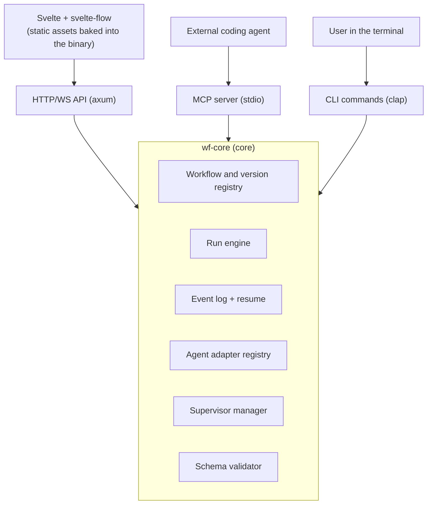
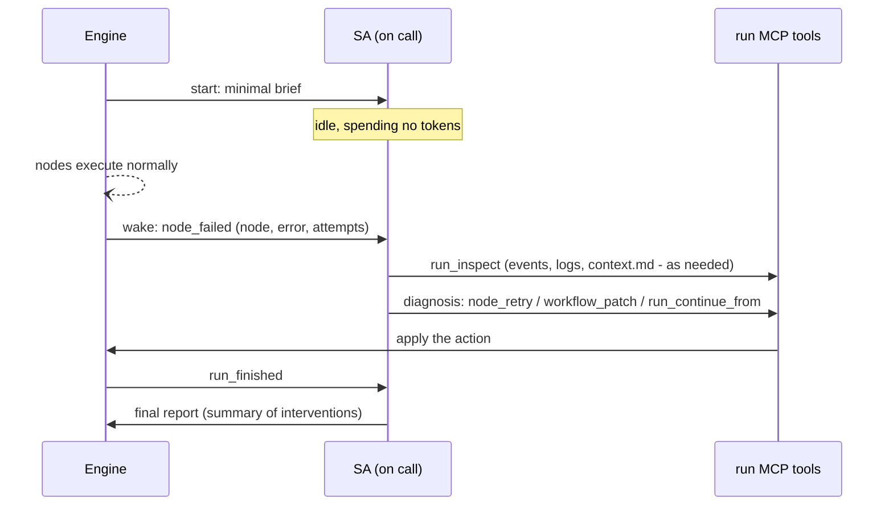
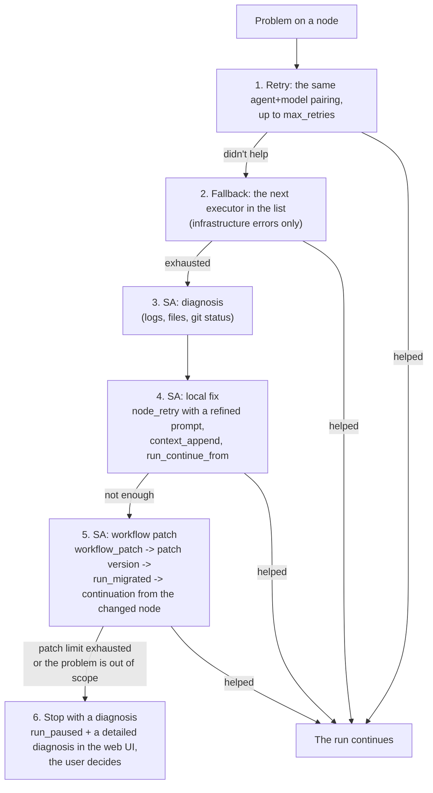

# Workflows CLI - design document

Date: 2026-07-08
Status: draft under review (revision 4: external review + patch-promotion model)

## 1. Overview

Workflows CLI is a standalone Rust tool that lets you describe multi-step agentic workflows in YAML, render and edit them in a svelte-flow-based web UI, run them locally via pluggable CLI coding agents (Claude Code, Codex, OpenCode, Pi, Hermes, etc.), and observe runs in real time.

The logical workflow model (nodes, edges, conditions, params, graph layout) is taken as a base from hermes-workflows, but without any binding to Hermes: the tool has its own execution engine, its own storage, and its own lifecycle.

The key difference from hermes-workflows is the supervising agent (hereafter SA): an agent that lives from the start of a run to its finish, watches the process, figures out the cause on failure, fixes it, and continues the run from the same spot. In complex cases the SA can stop the run, make an edit to the workflow itself (creating a patch version), and continue from the changed node.

### Goals

- One binary: run `wf` in the project folder and get the web UI, the engine, and an MCP server.
- Any valid YAML workflow renders in the web UI via svelte-flow.
- Full visual editor: drag-and-drop of nodes and connections, property forms, two-way sync with YAML.
- Reliable execution: retry, fallback agents, SA intervention, restart from any point.
- Semver-based workflow versioning with a clear major/minor/patch semantics.
- An MCP server through which an external coding agent sees and uses the workflows of the folder it was started in.

### Non-goals (within this design)

- Cloud or multi-user execution. The tool is local, single user, one project per instance.
- A proprietary LLM runtime. All LLM work is delegated to external CLI coding agents.
- File compatibility with hermes-workflows at the "copied the YAML - it worked" level. The model is similar, but the schema is its own.

### Invariants of the first working version

To avoid dragging in architectural complexity before the base is proven, the first working version stabilizes only the core:

- the `workflow.yaml` schema and validator (full contract in section 5);
- immutable version folders;
- an append-only event log and deterministic replay/resume;
- execution of a linear and conditional graph without automatic workflow edits.

Everything else - an autonomous SA, a visual editor with write access, parallel branches, MCP CRUD, ACP - are add-ons on top of these invariants and are not allowed to break them.

## 2. Terminology

- **Workflow** - a named directed graph of nodes with edges, described in YAML.
- **Workflow version** - an immutable folder of the form `.wf/workflows/<name>/<semver>/` with `workflow.yaml` and nested scripts.
- **Run** - a single execution of a specific workflow version.
- **Node** - a workflow step (start, agent_task, script, prompt, condition, human_review, wait, finish).
- **Executor** - a named pairing of "coding agent + model + ordered fallback list." A single reusable entity, used both in nodes and for the SA.
- **Profile** - a reusable description of an executor's role (system prompt + list of skills), located in `.wf/profiles/`.
- **SA (supervising agent)** - a long-lived agent that observes a run.
- **Shared run context** - an accumulating document made of completed nodes' reports, available to all nodes of the run.
- **One-off instruction** - text with the highest priority, entered when a run is started; not persisted into the workflow.

## 3. Architecture

### 3.1. Surfaces and core

One `wf` binary and one core, on top of which three surfaces operate:



Proposed workspace crate structure:

- `wf-core` - domain model, validator, engine, event log, supervisor manager, agent adapters.
- `wf-server` - axum: REST + WebSocket + serving the frontend's static assets.
- `wf-mcp` - MCP server (stdio) on top of `wf-core`.
- `wf-cli` - the binary, command parsing, wiring everything together.
- `web/` - the Svelte app (Bun, Vite, TypeScript, svelte-flow), built into static assets and baked into the binary via `rust-embed`.

### 3.2. Separation-of-concerns principle

The engine is deterministic: it drives the graph along its edges itself, spawns agent processes, applies retries and fallbacks, and writes events. The SA does not participate in routine planning and does not spend tokens while everything is going according to plan. Intelligence kicks in only where deterministic mechanisms have been exhausted.

## 4. File layout

### 4.1. The project folder `.wf/`

The CLI, run inside a project folder, looks for `.wf/`; if it is missing, it creates an empty structure.

```
.wf/
├── config.yaml                      # project settings (port, default executor, overrides)
├── workflows/
│   └── implement-task/              # workflow folder = its id
│       ├── current                  # pointer file to the active version, e.g. "1.3.42"
│       ├── layouts/
│       │   └── 1.3.42.yaml          # canvas layout: mutable, outside the immutable versions
│       ├── 1.2.0/
│       ├── 1.3.41/
│       └── 1.3.42/
│           ├── workflow.yaml
│           └── scripts/
│               ├── node-lint.ts
│               └── node-cleanup.sh
├── profiles/
│   ├── architect/
│   │   ├── profile.yaml
│   │   └── SOUL.md
│   └── fullstack/
│       ├── profile.yaml             # name, description, skills: [array of references to project skills]
│       └── SOUL.md                  # the role's system prompt
└── runs/
    ├── index.jsonl                  # lightweight run index: id, version, node statuses and durations
    └── 2026-07-08-a1b2c3/
        ├── run.yaml                 # metadata: workflow, version, params, instruction, overrides
        ├── events.jsonl             # append-only run event log
        ├── context.md               # shared context (derived, rebuilt from events)
        ├── supervisor/              # SA session log, its final report
        └── nodes/
            └── <node-id>/
                ├── attempt-1/       # stdout, stderr, agent transcript
                └── report.md        # the node's final report
```

Notes:

- A workflow version is a folder, not a file, because script-node scripts live inside the version (`scripts/`). This gives atomicity: a patch version cannot "break" a neighboring version's scripts.
- Version folders are strictly immutable: any edit creates a new version, no exceptions. The canvas layout is not part of the version - it lives in `layouts/` next to the `current` pointer (see section 10.4).
- `runs/` can be added to `.gitignore` via a template at `wf init` (run artifacts are usually not committed), whereas `workflows/` and `profiles/` are, conversely, expected to be under git.

### 4.2. Global config `~/.config/wf/config.yaml`

Descriptions of the available coding agents live in the CLI's root config, not in the user's project. A project's `config.yaml` may reference agents by id and override defaults, but does not describe launch commands.

```yaml
agents:
  claude-code:
    command: claude
    transport: acp            # acp | headless
    headless_args: ["-p", "--output-format", "stream-json"]
    models: [claude-fable-5, claude-opus-4-8, claude-sonnet-5]
  codex:
    command: codex
    transport: headless
    headless_args: ["exec", "--json"]
    models: [gpt-5.2-codex, gpt-5.2]
  opencode:
    command: opencode
    transport: acp
    models: [big-model, small-model]

executors:                    # global named executors, available to all projects
  default:
    agent: claude-code
    model: claude-fable-5
    fallbacks:
      - { agent: codex, model: gpt-5.2-codex }

defaults:
  executor: default           # reference by name
  supervisor_executor: default

runners:
  ts: [bun, deno]             # bun by default; deno is the fallback if bun is not installed
  py: [uv, python3]
  sh: [sh]

server:
  port: 7321                  # hardcoded default: deliberately outside the range of typical
                              # dev-server ports (3000/5173/8080), to avoid conflicting
                              # with the user's project frontends
```

### 4.3. Atomicity of file operations

The project relies entirely on files, so the write rules are fixed up front:

- Control files (YAML/JSON: `current`, `run.yaml`, configs, layouts) are written via temp file + fsync + atomic rename.
- `events.jsonl` is strictly append-only, with flush/fsync on terminal events (`attempt_finished`, `node_finished`, `run_finished`).
- `runs/index.jsonl` is a derived cache: it can be deleted, and it is rebuilt from the run folders.
- Creation of a version folder finishes with an atomic rename from a temporary name (see 10.2).

## 5. The workflow.yaml schema

A full example demonstrating every capability:

```yaml
schema: 1                      # file schema version; only grows with the CLI's major version
id: implement-task
name: Implement Task
description: >
  Implement a feature from a description: plan, implementation, checks, review, PR.
version: 1.3.42

params:
  - { name: task, type: text, label: "Task description" }
  - { name: branch, type: text, label: "Branch", default: "main" }
  - { name: strict, type: bool, label: "Strict mode", default: false }

executors:                     # named executors of this workflow
  main:                        # a local name overrides the global one on a name clash
    agent: claude-code
    model: claude-fable-5
    fallbacks:
      - { agent: codex, model: gpt-5.2-codex }
      - { agent: opencode, model: big-model }
  heavy:
    agent: claude-code
    model: claude-opus-4-8

defaults:
  executor: main
  max_retries: 1
  timeout_seconds: 3600

supervisor:
  executor: main               # the same executor entity, by name
  policy:
    max_patches_per_run: 5     # a safeguard against infinite self-edits
    wake_on: [node_failed, node_timeout, node_slow, run_stuck]
    slow_threshold_factor: 3   # node_slow: the node is running N times longer than expected
    capabilities: [observe, retry, patch_workflow, edit_workspace]  # default: all (see 9.5)
    promote_supervisor_patches: on_success   # see 10.5

nodes:
  - id: start
    type: start
    title: Start

  - id: plan
    type: agent_task
    title: Draw up the plan
    profile: architect
    executor: heavy            # reference by name; an inline block is also allowed for one-off cases
    prompt: |
      Draw up an implementation plan for the task: {{params.task}}

  - id: brief
    type: prompt
    prompt: "Only change what relates to the task. No incidental refactoring."

  - id: implement
    type: agent_task
    title: Implement
    profile: fullstack
    prompt: |
      Implement according to the plan:
      {{nodes.plan.output}}

  - id: lint
    type: script
    title: Lint and tests
    script: scripts/node-lint.ts   # path inside the version folder
    runner: ts                     # ts | py | sh (extensible)
    timeout_seconds: 300

  - id: check
    type: condition
    title: Did lint pass?
    max_loops: 3               # limit on iterations of the fix -> lint -> check loop

  - id: fix
    type: agent_task
    title: Fix the checks
    profile: fullstack
    prompt: |
      The checks failed. Output:
      {{nodes.lint.output}}
      Fix it and get to a green status.

  - id: review-gate
    type: human_review
    title: Human review
    options: [approved, rejected, needs_changes]

  - id: wait-ci
    type: wait
    title: Waiting for CI
    wait_for: { type: webhook, key: ci-done }   # webhook is post-MVP; in earlier phases only type: timer is available
    timeout_seconds: 7200

  - id: done
    type: finish
    outcome: success

  - id: aborted
    type: finish
    outcome: failure

edges:
  - { from: start, to: plan }
  - { from: plan, to: brief }
  - { from: brief, to: implement }
  - { from: implement, to: lint }
  - { from: lint, to: check }
  - { from: check, to: review-gate, condition: { type: node_status, node: lint, equals: success } }
  - { from: check, to: fix,         condition: { type: node_status, node: lint, equals: failure } }
  - { from: fix, to: lint }
  - { from: review-gate, to: wait-ci, condition: { type: review_status, equals: approved } }
  - { from: review-gate, to: implement, condition: { type: review_status, equals: needs_changes } }
  - { from: review-gate, to: aborted, condition: { type: review_status, equals: rejected } }
  - { from: wait-ci, to: done }
```

The canvas layout is not stored in `workflow.yaml` - it lives in `layouts/<version>.yaml` outside the immutable version (see 10.4). The format is `ui.xyflow` (the xyflow key is kept: svelte-flow is a product of the same xyflow team); when exporting a workflow, the engine can assemble the layout back into a single file, and on import it extracts it into `layouts/`.

Rules:

- `version` in the file duplicates the folder name; on a mismatch, the validator complains.
- Exactly one `type: start` node; execution always begins from it. The validator requires its presence and uniqueness.
- Templates: `{{params.<name>}}`, `{{nodes.<id>.output}}` (stdout for script, the report's `summary` for agent_task), `{{nodes.<id>.report}}` (the full report), `{{run.instruction}}`, `{{run.context}}`, `{{run.hooks.<key>}}`. Referring to a nonexistent value is a loud error at validation or execution time, not a silent empty string.
- The graph is directed; generally acyclic, but cycles are allowed if they pass through a condition node (like the fix -> lint -> check loop) - this way retry loops stay explicit. On a condition node that is part of a cycle, the validator requires `max_loops` (default 3): a counter of how many times that condition node executes within a single run. Exceeding the limit fails the node and is a reason to wake the SA.

### Minimal validator contract

The validator is the main character of phase 1; its contract is fixed in full:

- uniqueness of the workflow id, node ids, executor names, and param names;
- `version` matches the folder name;
- exactly one `start` node, with no incoming edges;
- `finish` nodes with no outgoing edges;
- all edges reference existing nodes;
- all nodes are reachable from `start`;
- every branch leads to a `finish`, otherwise the validator explicitly warns about a possible hang;
- a condition node's outgoing edges cover every outcome, or there is an edge with `fallback: true`;
- conditions reference only nodes that can execute before this condition node;
- cycles pass only through a condition with `max_loops`;
- script paths do not escape the version folder;
- templates reference existing params/nodes/hooks;
- executor and profile references resolve unambiguously;
- an executor's fallback list has no repeated agent.

A separate level is environment validation (`wf doctor`): checking that agents, executors, profiles, and runners actually resolve on the current machine. Schema validation does not concern itself with that.

## 6. Node types

### 6.1. start

The workflow's single entry point. Not executed, has no fields besides `title`, and cannot have incoming edges. It gives three things: an unambiguous start of the graph for the engine, an explicit visual anchor on the canvas, and an anchor point for future launch capabilities (launching with parameters attached to the entry point).

### 6.2. agent_task

The main worker node: spawns a coding-agent process with an assembled prompt.

Fields: `title`, `prompt`, `profile` (optional), `executor` (a name from `executors`, or an inline block; otherwise `defaults.executor`), `max_retries`, `timeout_seconds`, `workdir` (defaults to the project root).

Context assembly for the agent (in decreasing priority order):

1. The run's one-off instruction (if given) - explicitly marked as the highest priority.
2. The profile's SOUL.md + the profile's skills.
3. The texts of prompt nodes acting on this node (the scoping semantics are covered in 6.4).
4. The node's own `prompt` with templates expanded.
5. The run's shared context (context.md) or a slice of it.

**Report contract and node status.** An agent node's status is determined by its report, not by the process's exit code. The adapter adds to the prompt a requirement for a final block in a fixed format (a YAML block at the end of the response; where the agent supports structured output, via that instead):

```yaml
status: success | failure    # the agent's self-assessment, the basis for node_status in a condition
summary: brief summary of the work
files: [list of changed files]   # optional
notes: notes for downstream nodes    # optional
```

Parsing of the report block is implemented (adapter): the node's status comes from the agent's self-assessment (`status: success | failure`), not from the process's return code, and `status: failure` drives branching via `node_status`.

If the final block is missing or invalid, the node by default gets a `success` status - an opt-in implementation, so as not to break agents and stubs without the contract. The strict variant of the spec (`unknown` + an `anomaly` trigger that wakes the SA) has been deliberately deferred as a possible future tightening. A separate `nodes/<id>/report.md` is not yet written - the raw report goes into the shared `context.md`. The node field `success_check` is implemented: a deterministic sh-script check of the result on top of the agent's self-assessment - a nonzero exit code marks the node `failed` regardless of the report (the path is under `scripts/`, validated by V12, and present on the node's form in the web UI).

### 6.3. script

Deterministic execution of a script without an LLM. The script is a file inside the workflow version folder (`scripts/…`), not an inline command: it is versioned together with the workflow and edited in the web UI as code.

- `runner: ts` - executed via `bun` (by default) or `deno`: if bun is not on the machine and the user does not want to install it, the engine uses deno. The chain is set in the global config; the first runtime available on the machine is used.
- `runner: py` - `python3` / `uv run`.
- `runner: sh` - `sh`/`zsh`.
- The runner registry is extensible via the global config (`runners: { ts: [bun, deno], … }`).

Success/failure is determined by exit code. stdout is available as `{{nodes.<id>.output}}`. Scripts are given an environment via an allowlist from the config.

### 6.4. prompt

Authored text with no execution. Resolved instantly and mixed into agent_task nodes' context. It creates no cards and no processes.

The scope is defined unambiguously (important for loops and parallel branches): a prompt node acts on all downstream agent_task nodes - reachable from it along edges - and is active for a specific execution of a node if it itself was executed earlier in the current run, before that node's start.

Observability of this behavior is mandatory: the validator warns about a prompt node inside a loop or one that acts across parallel branches; each agent_task attempt's metadata records which prompt nodes were applied; the run monitor shows the attempt's effective context (exactly what went in: instruction, prompts, context slices).

### 6.5. condition

A routing node with no execution: branching by conditions on outgoing edges. Condition types: `node_status` (success/failure of a referenced node), `review_status` (a human_review decision), `output_match` (regex/substring match against a node's output). Outgoing edges must cover every outcome, or have an edge with `fallback: true`.

### 6.6. human_review

A pause until a human decides. The decision options are set in `options`. The decision is made in the web UI (buttons on the node), via the CLI (`wf review <run-id> <node-id> --decision approved --note "..."`), or via MCP (`review_decide`). The reviewer's note is available as `{{nodes.<id>.review_note}}`.

Running without the web UI is also covered: an interactive `wf run` shows the choice right in the terminal; in non-interactive mode a `review_requested` event goes to stdout (a json line), and the decision is made via `wf review` or MCP.

### 6.7. wait

Waiting for an external signal, with no process and no LLM: `wait_for: { type: timer, seconds: N }` or `wait_for: { type: webhook, key: <key> }`. `key` in YAML is a logical hook name, not a secret. At the start of a run, the engine generates an unpredictable `hook_secret` for each hook (stored in the run state) and stands up an endpoint `POST /api/hooks/<run-id>/<hook_secret>` - the URL is bound to the run and unguessable, so parallel runs cannot intercept each other's signals. The full URL is shown in the run monitor and is available to nodes as the template `{{run.hooks.<key>}}` (so it can be passed, for example, to CI). The broadcast mode `scope: workflow` (a signal to all active runs of the workflow) requires explicit opt-in and a separate workflow-scoped secret. `timeout_seconds` is mandatory; a timeout means the node fails (and is a reason to wake the SA).

### 6.8. finish

A terminal node: `outcome: success | failure`. Reaching finish ends the run (for parallel branches, see 8.4).

## 7. Executors, fallbacks, profiles

### 7.1. Executor - a single named entity

The `executor` block is described once in the schema and used everywhere LLM work is needed: in nodes and in the `supervisor` section. To make the block reusable, executors are named:

- **Global** - the `executors` section in `~/.config/wf/config.yaml`, available to all projects.
- **Workflow-local** - the `executors` section in `workflow.yaml`; on a name clash the local one overrides the global one.
- **Inline** - an anonymous block right in the node, for one-off cases.

```yaml
executors:
  main:
    agent: claude-code          # id from the global config
    model: claude-fable-5       # a model from that agent's model list
    fallbacks:                  # an ordered list, agents are not repeated
      - { agent: codex, model: gpt-5.2-codex }
      - { agent: opencode, model: big-model }
```

Fallback semantics: if the primary agent fails with an infrastructure error (rate limit, overload, binary unavailable, invalid transport response), the engine tries the next fallback with the same prompt and context. Fallbacks are only different agents (the validator forbids repeating an agent in the list). An infrastructure error is distinct from a substantive failure: if the agent ran to completion but the outcome is "the task was not solved," no fallback is applied - that is the territory of retry and the SA.

Order of handling problems on a node:

1. `max_retries` - repeat the same agent+model pairing.
2. Fallbacks in list order (each with its own retries).
3. Everything exhausted - a `node_failed` event, the SA is woken.

### 7.2. Transport: ACP and headless

For talking to coding agents, the Agent Client Protocol (ACP) is used where the agent supports it: a persistent connection, streaming of session events, structured results, and the ability to pass permissions. For agents without ACP, there is a headless mode: launching a CLI process with a prompt and parsing stream-json/stdout via an adapter.

The adapter is a trait in `wf-core`:

```
trait AgentAdapter {
    spawn(task) -> Session;      // start a session with context
    stream(Session) -> Events;   // progress stream (for the web UI and logs)
    result(Session) -> Report;   // structured outcome
    classify_error(...)          // error class, see the table below
}
```

Result normalization is mandatory for every attempt: the raw transcript is always saved; the adapter tries to extract a structured report; if that fails, it creates a synthetic report with an `unknown` status, a cause, and a link to the transcript. Error classes are a fixed enum with an unambiguous engine reaction:

| Class | Example | Engine reaction |
|-------|--------|----------------|
| `transport` | the ACP connection dropped, invalid stream-json | fallback |
| `process_exit` | the agent's CLI crashed, rate limit, overload | retry, then fallback |
| `structured_output_missing` | the agent finished, but the final block is missing or invalid | `anomaly`, the SA is woken |
| `agent_reported_failure` | the report is valid, `status: failure` | `node_status = failure`: retry per `max_retries`, then normal branching or the SA |

For the first implementation - a single headless adapter (Claude Code) and one output format; generality is designed for after it has been battle-tested.

> **Implementation status (Phase 8e, revision from 2026-07-10).**
> Done to a reasonable extent for now, with a deliberate allowance for further work:
> - Pluggable transport at the agent level (global config `agents.<id>.transport`): `headless` (default, a one-shot buffered `claude -p`) and `acp`.
> - The `acp` transport is implemented on top of Claude Code's stream-json streaming format: agent events are read line by line in a background thread and streamed into a per-attempt NDJSON log `runs/<id>/agent-stream/<node>-<attempt>.jsonl` (the basis for live streaming to the web UI and logs), with the final result extracted from the terminal `type: result` event (`is_error` -> node status failure = agent_reported_failure).
> - The error classes from the table above are honored: a dropped/invalid stream with no result -> `transport`, a nonzero exit code -> `process_exit`, a successful exit code with no result event -> `structured_output_missing`. Cancellation (join:any) and timeout (`timeout_seconds`) kill the streaming process the same way as headless.
>
> **Provisional / deliberately deferred (to finish/redo after battle-testing):**
> - The exact schema of Claude Code's stream-json is not rigidly pinned down: parsing is lenient (unrecognized lines are skipped). Cross-check against real `claude` output and tighten it.
> - The full Agent Client Protocol on top of this same `acp` value: JSON-RPC `initialize` / `session.new` / `session.prompt` / streaming `session.update`, the permissions model, and client callbacks, handling of ACP disconnects. Right now `acp` is exactly stream-json, not JSON-RPC sessions.
> - Breadth of agents beyond Claude Code (adapters for other headless/ACP agents, `headless_args`, per-agent model defaults).
> - Honest `isolation: full | best_effort | none` level (8e-2): the field exists in the agent_task node schema, is shown on the node's form in the web UI, and the validator warns (V16) that isolation is declared but is NOT yet enforced by the engine (execution happens in a shared working folder). Real enforcement (a worktree per node, see 8.3) is for the future.
> - The deadlock risk from heavy stderr output is closed (stderr is drained on a separate thread); when moving to JSON-RPC, revisit the I/O model.
> - Cancellation/timeout tear down the agent's entire process group (Unix: `process_group(0)` at spawn + `kill(-pgid, SIGKILL)`), not just the direct child, so as not to orphan the tree (node, MCP servers, tool subprocesses). Non-Unix falls back to `child.kill()`.

### 7.3. Profiles

A profile is a reusable executor role, applicable across different nodes and workflows. Inspired by Hermes's profile distributions, but deliberately simplified: no cron, no mcp.json, no copying of skills.

```
.wf/profiles/fullstack/
├── profile.yaml
└── SOUL.md
```

`SOUL.md` is the role's system prompt; the name is inherited from the Hermes vocabulary (profile distributions).

```yaml
# profile.yaml
name: fullstack
description: Full-stack engineer for the project
skills:                      # references to project skills, not copies
  - coding-standards
  - testing
```

The project's skills folder is set in the project `config.yaml` (`skills_dir`); by default, standard paths are auto-detected (e.g. `.claude/skills/`). The name in `skills` is the name of the skill's subfolder within that directory.

Skill semantics:

- If `skills` is specified, the agent is given **only** the listed skills; the rest of the project's skills are isolated, to whatever extent the specific agent's mechanics allow (the adapter knows how: for some agents, by presenting a separate skills folder with symlinks, for others, by explicitly listing them in the prompt and forbidding the rest).
- If `skills` is not specified, the agent sees all of the project's skills in its native mode, with no restrictions.
- Full isolation is not achievable for every agent; the adapter must honestly report the support level (`isolation: full | best_effort | none`), and this is visible in the web UI on the node's form.

## 8. Run engine

### 8.1. Event sourcing

Every run is an append-only log `events.jsonl`. An event: `{ seq, ts, type, payload }`. Main types:

- `run_started` (workflow, version, params, overrides; the one-off instruction text lives in run.yaml, the event references it)
- `node_scheduled`, `node_started`, `node_progress`, `node_output`, `node_finished` (status, report ref)
- `attempt_started`, `attempt_finished` (attempt_id; the terminal event for each attempt)
- `retry_started`, `fallback_triggered` (from which executor to which)
- `review_requested`, `review_decided`
- `wait_started`, `wait_signalled`, `wait_timeout`
- `supervisor_woken` (reason), `supervisor_action` (what it did), `supervisor_lost` (the external SA disappeared, a background one was raised), `patch_applied` (the new version, a diff summary)
- `run_migrated` (the run was moved to a new version)
- `run_paused`, `run_resumed`, `run_finished` (outcome, summary)

A run's state is a pure fold over its events. It follows that:

- **Resume from any point**: `wf resume <run-id> [--from-node <id>]` restores state by replaying and continues. Nodes' side effects are not rolled back - resume means "continue execution from node X, trusting the current state of the working folder"; the responsibility for judging appropriateness lies with the user or the SA.
- **Live streaming**: events are relayed to the web UI over WebSocket, and the graph highlights node statuses in real time.
- **Full SA audit trail**: every intervention is an event, and the SA's final report is assembled from them.

**Guarantee boundaries and interrupted attempts.** The event log guarantees recovery of `wf`'s internal state, but it does not roll back or make idempotent the external effects of nodes: agents change files, scripts can push and call APIs. Hence these rules:

- Every node attempt has an `attempt_id`, its own log folder, and must end with a terminal `attempt_finished` event.
- If, after a process restart, an attempt is found with no terminal event, the node gets an `interrupted` status - neither failed nor success: the effect may have been partially carried out.
- An interrupted node is not automatically retried. Repeating it requires either an explicit `wf resume` or a decision by the SA, which may first inspect the actual state of the working folder.

### 8.2. Scheduler

A tokio task per run. Loop: take the nodes ready for execution (all incoming edges satisfied) -> run them -> wait for completion -> compute the next ones along edges and conditions. Condition nodes and prompt nodes are resolved synchronously.

### 8.3. Parallel runs and isolation

A workflow is a static definition; a run is an independent instance of it. Starting a workflow does not block starting the same workflow in parallel: any number of runs of the same version (and of different versions) can be in progress simultaneously, without mixing.

Isolation is achieved by having all of a run's state live only in its `runs/<run-id>/` folder: its own event log, its own `context.md`, its own node reports, its own SA session, its own agent processes. The scheduler is a separate tokio task per run, and there is no shared mutable state between runs. A run reads its workflow version as an immutable snapshot at start (the effective workflow, see section 11), so even the appearance of a new version, or an SA patch in a neighboring run, does not affect it.

The one shared resource is the project's working folder, where agents edit files. Two levels:

- Strict default: only one write-run (a run with agent_task/script nodes) may work in a given working folder at a time. Attempting to start a second one is rejected with a hint: run it in a worktree, or explicitly allow it with the `--allow-shared-workdir` flag (in which case the user is responsible for file-effect conflicts - reasonable for read-only workflows or tasks known not to overlap).
- The `workspace: worktree` option at launch: the engine creates a git worktree per run, agents work in an isolated copy, and the result is merged back through normal git mechanisms. This is the recommended mode for concurrent runs that change code.

### 8.4. Parallel branches

Several unconditional outgoing edges from one node mean parallel branches, each executed simultaneously (each with its own agent process). Convergence happens at any node with multiple incoming edges and a `join` field:

- `join: all` (default) - wait for all incoming branches; a failure of any one is a failure of the join node (a reason for the SA).
- `join: any` - the first branch to finish carries the flow forward, the rest are cancelled.

Reports of parallel nodes are written into `context.md` in completion order, tagged with the branch. Reaching `finish` in one of the parallel branches ends the run and cancels the remaining branches.

### 8.5. Shared run context

`context.md` is a run's accumulating document. After each node finishes, its report (report.md) is appended as a section: a heading with the node id, status, attempt number and time, followed by the report's content.

The source of truth is the events and report files, and `context.md` is a derived artifact (a materialized view) that can be deterministically rebuilt at any time from `events.jsonl` (section order = the order of `node_finished` events by `seq`). This guarantees reproducibility of resume and replay even with parallel branches, where the completion order of nodes is non-deterministic between runs.

The context is available to **all nodes of a run, not only "downstream" ones**: a workflow often contains loops, and execution can go back to an earlier node (fix -> lint -> check -> fix). Each time a node executes, it gets the context state as of that moment:

- the full `{{run.context}}`; once a configurable size limit is exceeded, the engine asks a cheap model from the config to compress older sections, but the result is written to a separate `context_compact.md` (an LLM artifact, non-deterministic), while the primary `context.md` is not replaced - replay reproducibility is preserved; the compaction event references the compact file and the model; in that case nodes are given the compact version plus the uncompressed tail of the full context;
- targeted slices: `{{nodes.<id>.output}}` - for script this is stdout, for agent_task the `summary` field from the report; `{{nodes.<id>.report}}` - the full report of an agent node. Always the value from the node's most recently completed execution.

When a node re-executes within a loop, its new report does not overwrite the old one but is appended as a new section with an iteration number; the template `{{nodes.<id>.output}}` points to the latest one.

### 8.6. One-off instruction

When starting a run (web form, `wf run --instruction "…"`, an MCP parameter), text with the highest priority can be entered. It:

- is shown on the launch screen and in the run monitor;
- is mixed into every agent_task node and into the SA as the first block, marked "priority higher than any workflow prompts";
- is stored only in `runs/<id>/run.yaml`, does not end up in the workflow, and does not participate when new versions are created.

### 8.7. Statuses: a single state machine

So that the UI, scheduler, condition, resume, SA, and MCP all interpret statuses the same way, the set is fixed in tables.

Node statuses:

| Status | Meaning |
|--------|----------|
| `pending` | waiting for incoming edges to be satisfied |
| `ready` | ready to run, waiting for a slot |
| `running` | executing (has an active attempt) |
| `succeeded` | finished successfully |
| `failed` | finished with a failure (including agent_reported_failure after retries) |
| `unknown` | report is missing or invalid (anomaly) |
| `timed_out` | timeout_seconds exceeded |
| `interrupted` | an attempt with no terminal event after a process restart |
| `skipped` | the branch was not chosen by a condition, or was cancelled by join/finish |
| `cancelled` | stopped by an explicit action (abort, branch cancellation) |

Run statuses: `created`, `running`, `waiting_review`, `waiting_signal`, `paused`, `succeeded`, `failed`, `aborted`, `interrupted`.

Mapping for `condition.node_status`: `equals: success` corresponds to `succeeded`; `equals: failure` corresponds to `failed` and `timed_out`. The statuses `unknown` and `interrupted` do not participate in branching - they halt progress and wake the SA.

## 9. The supervising agent

### 9.1. Lifecycle

The SA lives from the start of a run to `run_finished`. It is an ordinary coding agent, described by an `executor` block (by name or inline) in the workflow's `supervisor` section or in the global config's defaults, with its own model and fallbacks - the same mechanism as for nodes, implemented once. Who actually acts as the SA depends on how the run was launched (see 9.2): either a background agent spawned by the engine, or the coding-agent session from which the user launched the run.

The mode is strictly on-call and event-driven:

- At start, the SA gets a minimal brief: workflow id, version, params, the one-off instruction, a reference to its tools. The full run context is **not** pumped into it.
- A background SA is spawned by the engine as an ordinary agent process; the engine passes it the MCP connection config (endpoint + supervisor token) in whatever way is native for that specific agent (env, flags, session config) - the adapter knows how.
- While the run proceeds normally, the engine sends the SA nothing. No progress events, no node reports. The SA sits idle and spends no tokens.
- On waking, the SA gets only a description of the problem (which node, which error, which attempts have already been made). It **pulls** everything else itself, as needed, via tools: the run context, attempt logs, project files. A pull model, not push.



### 9.2. Who acts as the SA: binding to the launch source

- **Launch from a coding agent (via MCP).** If the user tells their agent "run such-and-such workflow" (or invokes a command), that very session becomes the supervisor: the `workflow_run` tool accepts a `supervise: self` parameter, the engine does not spawn a background SA, and instead issues the calling session a supervisor token and the supervisor tool set. Diagnosis and fixes happen right in the user's own session, in front of them. The `supervisor.executor` section is ignored in this case - it will only be needed by the fallback background SA after a `supervisor_lost` event.
- **Launch from the CLI or the web UI.** The SA is started by the engine in the background as a separate agent process (the normal mode from 9.1); `wf run` and the web form require nothing extra.

Mechanics of the external SA: MCP has no way to push notifications into an agent session, so waking is implemented as a long pull call - the `supervisor_wait_event` tool blocks until the nearest wake event (or until the run finishes / the call times out). The SA agent spins a loop: `wait_event` -> figure it out -> act -> `wait_event` again.

Fallback: if the external SA has stopped polling (a heartbeat threshold, session disconnect, the user closed the agent), the engine writes a `supervisor_lost` event and raises a background SA via the supervisor's executor chain - the run is never left unsupervised. There is no hand-back: a returning session sees from the events that supervision has passed to the background SA.

### 9.3. Wake triggers

Only errors and problems; the SA is not involved in normal progress:

- `node_failed` - a node failed after all retries and fallbacks.
- `node_timeout`, `wait_timeout`.
- `node_slow` - a node is running substantially longer than expected (threshold: `slow_threshold_factor` off the median of that node's past runs, or off `timeout_seconds` if there is no history). Duration history is taken from `.wf/runs/index.jsonl` - a lightweight index appended to when each run finishes (it also speeds up the run list in the web UI, without scanning every runs/ folder). The index is a derived cache, not a source of truth: if it is missing or corrupted, `node_slow` relies only on `timeout_seconds` (or stays silent until history accumulates), and the index is rebuilt from the run folders.
- `run_stuck` - no progress for longer than a threshold.
- `anomaly` - the adapter flagged the result as suspicious (an empty report, invalid structure).
- An explicit request from the user in the web UI ("call the SA").

The set is configured in `supervisor.policy.wake_on`.

### 9.4. SA tools

The SA connects to this same CLI's MCP server (a supervisor tool set, not available to ordinary nodes):

- `supervisor_wait_event` - a long call that returns on the nearest wake event; the main loop of the external SA (9.2). Not needed by a background SA: the engine itself wakes it.
- `run_inspect` - events, node statuses, context.md, attempt logs. This is exactly how the SA pulls in context when it decides it needs to.
- `node_retry` - restart a node (optionally with a one-time modified prompt).
- `run_continue_from` - continue the run from a given node.
- `run_pause`, `run_abort`.
- `workflow_patch` - change the workflow's YAML. Required arguments: the edit's classification (`improvement | workaround`, see 10.5) and the point where the run continues. The engine validates it (migration rules - 10.3), creates a patch version, moves the run onto it (`run_migrated`), and continues from the specified node.
- `context_append` - append a note to the shared context (for example, "the lint node is failing because of X, downstream nodes should take that into account").
- `supervisor_report` - submit the final report (9.6). A single mechanism for both the background and the external SA.

Besides the tools, the SA has ordinary access to the project's working folder (it is a coding agent after all): it can look at logs, files, and git status itself to make a diagnosis.

### 9.5. Autonomy and safeguards

The SA's autonomy is structured as a capability model. Capabilities:

- `observe` - read events, logs, context;
- `retry` - restart nodes, add one-off clarifications, continue the run;
- `patch_workflow` - change the workflow (patch versions);
- `edit_workspace` - change project files through its ordinary agent access.

The default is all capabilities enabled: the SA fixes, patches, and restarts without confirmation (self-improvement is a goal of the project). A workflow's policy can shrink the set (`supervisor.policy.capabilities`). An honest caveat about `edit_workspace`: `wf` technically cannot forbid a coding agent from changing project files - this is a declaration of mode, not a sandbox; when this capability is enabled, the web UI shows a risk-mode marker, and for such runs `workspace: worktree` is recommended.

Limiters:

- `max_patches_per_run` (default 5) - once the limit is exhausted, the SA must stop the run and leave a diagnosis; patches rejected by the validator also count against it.
- Every action is an event in the log; a live "intervention log" is visible from the web UI.
- Patches only change the patch component of the version; the SA cannot change major/minor and cannot touch other workflows.
- A patch does not become the norm automatically - only through promotion on success (10.5).

### 9.6. Final report

On `run_finished`, the SA submits a final report via the `supervisor_report` tool (written to `supervisor/report.md`): the run's outcome, whether it made modifications, how many and which ones (a brief digest of the `supervisor_action` and `patch_applied` events). If the SA does not submit a report within the timeout (the external session closed, the background process died), the engine generates an auto-summary from the `supervisor_*` events - a run page is never left without a report. The report is shown in the web UI and returned via MCP.

## 10. Workflow versioning

### 10.1. Semver semantics

- **major** - a fundamentally new edition of the workflow. Created only by an explicit user action ("new major version").
- **minor** - a change made by the user: editing prompts, nodes, edges via the web editor, MCP, or files.
- **patch** - an improvement made by the SA during a run.

Honest caveat: the X.Y.Z format here is a revision numbering by change authorship (user/supervisor), not classical semver compatibility semantics. A user's edit is always minor, an SA's edit is always patch, regardless of the scale of the behavior change.

### 10.2. Mechanics

- The `current` file points to the active version. Launching by default uses `current`; any version can be run explicitly (`wf run implement-task --version 1.2.0`).
- Any save from the web editor produces a new minor version (copying scripts/ and applying the edits). Direct editing of files on disk is also supported: a file watcher notices changes inside an existing version and offers, in the web UI, to "commit as a new minor version" (the on-disk version modified this way is marked dirty).
- SA patch: the engine copies the version folder, applies the edit, validates it, writes `patch_applied`. The `current` pointer does not move at this point - the patch's fate is decided by promotion on success (10.5).
- Only the core issues new version numbers: creation of versions for a given workflow is serialized (a mutex on the workflow + an atomic folder rename), so concurrent patches from two SAs, or a patch and a web save, cannot produce the same number.
- Version history is visible in the web UI with a structural diff (nodes added/removed/changed) and a textual YAML diff.

### 10.3. Runs and versions

A run is bound to a specific version. The only way to change version on the fly is `run_migrated` during an SA patch: the engine matches nodes by id, the state of completed nodes is preserved, and execution continues from the changed node.

The migration validator applies three rules to keep the run's history consistent:

1. Only nodes that have not yet executed, or the one the run will continue from, can be patched - a patch is always paired with a continuation point.
2. Executed nodes cannot be deleted: their reports are part of the context history.
3. Node ids cannot be changed: the id is the matching key during migration.

An invalid patch is rejected with diagnostics for the SA; a rejected attempt still counts against `max_patches_per_run`.

### 10.4. Layout outside versions

The canvas layout is stored not in `workflow.yaml` but in `layouts/<version>.yaml` next to the `current` pointer. Version folders remain strictly immutable, with no exceptions; the layout is mutable and has no effect on execution, diff, or replay. When a new version is created, the layout is copied from the parent. On workflow export, the engine can assemble `ui.xyflow` back into a single file; on import, it extracts it into `layouts/`.

### 10.5. Promotion of SA patches: on success

A patch does not become the norm by the mere fact of being created - it has to prove itself:

- The patch version is created, the current run migrates onto it, and continues (10.3).
- `current` moves automatically the moment the patched run reaches a successful finish and the changed nodes ran successfully. The patch is validated by that very run it was created for.
- If the run still fails, the version remains an unpromoted candidate: visible in history marked "created by the SA in run X, unconfirmed," and subsequent launches keep using the previous `current`. Emergency edits do not accumulate on the active line.
- The SA classifies each edit in `workflow_patch`: `improvement` - a universal improvement, promoted on success; `workaround` - a workaround for the circumstances of a specific run (a failed external service, a one-off project state), not promoted even on success.
- Policy: `promote_supervisor_patches: on_success` (default) `| after_n_successes: N | manual | always`.

This way the system self-improves without human involvement, but the workflow's evolutionary line consists only of edits confirmed by a successful run. Full traceability in version history: who created the patch, whether it was promoted, and why. Rollback is a normal operation: `current` can be manually pointed at any version.

### 10.6. Deletion

- Deleting a workflow from the web UI or MCP moves its folder into `.wf/trash/` (recoverable); physical deletion is a separate, explicit action.
- Runs are never deleted automatically.
- A version referenced by existing runs cannot be physically deleted without a force flag.

## 11. Per-run modifications without new versions (implemented)

Scenario: run the same workflow with different models to compare which models work better specifically in this workflow. Creating versions for this would be wrong: the workflow's semantics do not change, only the execution of a specific run does.

Implemented (details and remaining gaps are in the "Implementation status" block below):

- A run accepts an optional `overrides` section (saved to `runs/<id>/run.yaml`), for example:

```yaml
overrides:
  executors:
    main: { agent: claude-code, model: claude-sonnet-5 }
  nodes:
    implement: { executor: { agent: codex, model: gpt-5.2-codex } }
```

- The engine works not with the version directly, but with the "effective workflow" = version + overrides, computed at run start. This is the single point through which all code (scheduler, context assembly, web monitor) obtains the workflow definition. While overrides are empty, the effective workflow is identical to the version.
- The version's files are not touched, `current` does not move, and no versions are created.
- Future development on top of this mechanism: matrix runs (one button "run with three models"), comparing results across runs, prompt A/B testing.

The cost of laying this groundwork is minimal: one "effective workflow" abstraction at run start, plus a field in run.yaml and in `run_started`.

> **Implementation status.** Implemented: `RunOverrides{executors, nodes}` (wf-core), applied in `prepare_run` -> the effective workflow (version + overrides), which all downstream code then sees; the run snapshot, when overrides are present, is the serialized effective workflow; overrides are saved into `run.yaml`. CLI: `wf run --overrides <file.yaml>`. Not yet done: overrides under `--supervise` (the detached process does not forward them - an explicit error), matrix runs/comparison (UX on top of this mechanism), a field in the `run_started` event itself (the record currently goes into run.yaml).

## 12. Web interface

Stack: Bun (runtime and package manager), Vite, Svelte, TypeScript, svelte-flow (@xyflow/svelte), headless UI components - bits-ui or homegrown ones (final choice is open question 5 in section 21), CodeMirror as the code editor (the YAML panel and the script editor). Built into static assets, baked into the binary. svelte-flow documentation for the implementation stage: https://svelteflow.dev/llms-full.txt (see section 22).

Screens:

1. **Workflow list** - cards: name, description, active version, recent runs. Create, delete (with trash/confirmation), duplicate.
2. **Workflow editor** - the main screen:
   - svelte-flow canvas: drag-and-drop of nodes from a type palette, connecting edges, conditions on edges;
   - a property panel for the selected node (forms per node type: prompt, executor with fallbacks, profile, timeouts);
   - a YAML panel with two-way sync (editing the YAML redraws the graph, editing the graph updates the YAML); the source of truth is the YAML on disk;
   - a script editor for script nodes;
   - live validation: schema errors are highlighted on nodes and in the YAML;
   - saving creates a new minor version; a version switcher with a diff.
3. **Launch** - a params form generated from the schema, a one-off instruction field (large, marked with its priority), a version picker.
4. **Run monitor** - the same graph with live node statuses (over WS), a log stream for the selected node, the shared context, each attempt's effective context (which instruction, prompts, and slices went in), the SA's intervention log, human_review buttons, controls (pause, stop, resume from a node).
5. **Run history** - a list, filters, SA reports.
6. **Profiles** - a list and editor for profiles (SOUL.md + skills).
7. **Settings** - a view of the global agent config (read-only, with a hint about where the file lives), project settings.

Rendering arbitrary YAML: if a file has no `ui.xyflow`, an auto-layout (dagre/elkjs) is applied - any valid workflow always renders.

## 13. MCP server

`wf mcp` is a stdio MCP server. A coding agent started in a project folder with this MCP sees the workflows of that exact folder (the server resolves `.wf/` from the cwd). If the main `wf serve` is already running in that folder, `wf mcp` acts as a thin client of its API (so there is only one engine); otherwise it brings up the core itself.

Detecting a running server happens via a lock file `.wf/serve.lock` (port, PID, project-root fingerprint, server instance id), which `wf serve` creates at startup and removes on shutdown. On connecting, `wf mcp` does a handshake: it checks the fingerprint and instance id, so as not to attach to another project's server or to a stale PID reused by the system. A stale lock is detected by a dead PID or a failed handshake. The same lock guards against an accidental second `wf serve` in the same folder.

Supervisor tokens are bound to a `run_id` and a session, have a lifetime, and are renewed by a heartbeat; when the run finishes, the token is invalidated.

Tools (the full surface, CRUD + launch):

- `workflow_list`, `workflow_get` (YAML + version metadata)
- `workflow_create`, `workflow_update` (validation; update = a new minor version), `workflow_delete`
- `workflow_validate`
- `workflow_run` (params, one-off instruction, `supervise: self | background`, default background) - the CLI's engine executes it, the tool returns a run-id; with `supervise: self` the calling session gets a supervisor token and becomes the SA (9.2)
- `run_status`, `run_events` (paginated by seq), `run_report`
- `run_cancel`, `run_resume`
- `review_decide`

Supervisor tools (9.4) are split into a separate set and are available only to an SA session holding a supervisor token: to a background SA, issued by the engine at spawn time; to an external session, issued in the `workflow_run` response when `supervise: self` was used. A coding agent without a token cannot patch someone else's run.

## 14. CLI commands

```
wf                      # = wf serve: pick up/create .wf, bring up the web UI (port from config)
wf init                 # create an empty .wf structure without starting the server
wf serve [--port N] [--no-open]
wf list                 # workflows and their versions
wf validate [name]      # check the schema
wf doctor               # environment validation: agents, executors, profiles, runners resolve on this machine
wf run <name> [--version X] [--param k=v ...] [--instruction "..."] [--workspace worktree] [--allow-shared-workdir]
wf runs [--status ...]  # list of runs
wf resume <run-id> [--from-node <id>]
wf review <run-id> <node-id> --decision <opt> [--note "..."]
wf mcp                  # stdio MCP server
wf dev                  # development mode for the tool itself
wf --version            # the CLI's version (semver)
```

In an interactive terminal, `wf run` shows progress (node statuses); in a non-interactive one, it writes events to stdout (json lines).

## 15. Dev mode and hot reload

Two distinct "hot reloads," both covered:

1. **For the tool's user** (production mode): a file watcher on `.wf/` - edits to YAML/scripts/profiles from disk are picked up instantly, the web UI gets a WS event and redraws the graph. Nothing needs restarting.
2. **For the tool's developer** (`wf dev`): the frontend is served by the Vite dev server with HMR (the binary proxies to it instead of serving static assets), and the Rust backend is restarted via `bacon`/`cargo-watch` while run state survives (the event log survives a process restart by design). `wf dev` prints a hint for starting both processes, or starts them itself as child processes.

## 16. Error handling: an escalation hierarchy



Separately: a crash of the `wf` process itself does not lose runs - the event log is on disk; after a restart, unfinished runs are visible and resumable (`wf resume`). A crash of the SA process: the engine recreates its session via the supervisor's fallback chain (this event is logged too).

## 17. Security and boundaries

- The web server listens on `127.0.0.1` by default; opening it up externally requires an explicit flag.
- Scripts get an environment via an allowlist; running scripts can be globally disabled in the config (`scripts_enabled: false`).
- Agent keys and secrets are the concern of the agent CLIs themselves (their configs); `wf` does not store secrets.
- Supervisor MCP tools are isolated by the SA session token.
- SA patches are limited to the patch component of the version and to a per-run limit.

## 18. Technology stack

| Layer | Choice |
|------|-------|
| Core language | Rust (edition 2024) |
| Async | tokio |
| Web server | axum + tower |
| WS | axum ws |
| Serialization | serde + serde_yaml (or yaml-rust2), serde_json |
| CLI | clap |
| Static assets in the binary | rust-embed |
| File watcher | notify |
| MCP | rmcp (the official Rust SDK) |
| JS runtime and packages | Bun (deno is the fallback for the ts runner if bun is not installed) |
| Frontend build | Vite |
| Frontend | Svelte + TypeScript |
| Graph | svelte-flow (@xyflow/svelte) |
| UI components | bits-ui or homegrown headless components (final choice - open question 5) |
| Auto-layout | dagre or elkjs |
| Code editor | CodeMirror 6 |

Notes on the choices: axum is mature and works great with tokio and ws; rmcp is the official SDK, with stdio transport out of the box; svelte-flow is a requirement of the task, a product of the xyflow team (the same node/edge model as react-flow, which is why the `ui.xyflow` section is format-compatible); CodeMirror is lighter than Monaco and sufficient for YAML/TS/PY/SH.

Important: specific versions of all packages (crates and npm) are, at the implementation stage, not chosen from the LLM's memory but checked by searching for current versions online. Additional packages may be downgraded, with a double check of compatibility, if their latest version is not supported by the main stack packages.

## 19. Development process

- **TDD.** CLI development follows test-driven development: first a failing test, then implementation to green, then refactoring. The core (`wf-core`) is designed so that the engine, validator, and event fold can be tested without spawning real agents: adapters are mocked via the `AgentAdapter` trait, and runs are checked against fixture event logs.
- **Frontend tests.** Logic via vitest, primarily the two-way YAML - graph conversion (the buggiest area of editor sync). On top of that, Playwright smoke tests for key editor and monitor scenarios.
- **Semver of the CLI itself.** `wf` releases follow semver: major for breaking changes to the `workflow.yaml` schema or the CLI interface (the workflow's `schema` field grows along with major), minor for new capabilities, patch for fixes. A changelog is kept; `wf` can read workflows of every schema within its major version and suggests a migration on upgrade.
- **Dependency versions.** See section 18: package versions are checked online at implementation time, not taken from the LLM's memory.

## 20. Implementation phases

**Phase 1 - core and viewing.** YAML schema + validator (TDD from the first commit), the `.wf/` structure, `wf init/serve/list/validate`, web UI: workflow list and graph rendering (read-only, auto-layout), file watcher + WS, a release pipeline with semver.

**Phase 2 - execution.** The engine with an event log, agent_task via a headless adapter (first agent - Claude Code), script (sh, then ts/py), condition, prompt, start, finish, retries and fallbacks, named executors, `wf run/runs/resume`, a run monitor in the web UI, shared context, the one-off instruction, the "effective workflow" abstraction (groundwork for overrides).

**Phase 3A - SA: observation and fixing.** The supervisor manager, the on-call session, observe/retry supervisor tools (`supervisor_wait_event`, `run_inspect`, `node_retry`, `run_continue_from`, `context_append`, `supervisor_report`), the final report, the intervention log in the web UI.

**Phase 4 - editor.** The full visual editor with two-way YAML sync, minor versions from the web UI, version diffs, the script and profile editors.

**Phase 3B - SA self-edits.** `workflow_patch`, patch versions, run migration rules, promotion on success. Placed deliberately after phase 4: the SA's riskiest capability is built on the version, diff, and validation mechanisms already battle-tested by the editor and by manual edits.

**Phase 5 - MCP and polish.** The public MCP server (CRUD + launch), human_review and wait (webhook with secrets), parallel branches with join, the ACP transport, `wf dev`, distribution (brew/cargo install/binaries).

The SA appears early (3A - right after the engine, since it is the tool's main distinguishing value), but it only gets the right to change workflows once the base is mature (3B).

## 21. Open questions

1. Binary name: `wf` is short but may conflict with existing utilities; alternatives - `wfl`, `flowd`, a proprietary product name. Decide before phase 1 starts: the name will end up in config paths, lock files, documentation, and MCP examples, and changing it later is expensive.
2. Format for passing a profile's skills to different agents: each agent has its own skill-attachment mechanics; the adapter will need a mapping table and an honest isolation level (7.3).
3. Compressing context.md on long runs: who compresses it - a cheap model from the config, or the SA; the proposed approach is "configurable, default is a cheap model."
4. wait/webhook when the server is not exposed externally: for local use, `curl localhost` is enough, but for CI signals a tunnel or polling might be needed; in the MVP - timer and local webhook.
5. Headless UI components: base-ui was originally proposed, but it is a React library (@base-ui/react) and does not work directly for Svelte. The stack currently lists a svelte-native analogue with the same philosophy - bits-ui, with homegrown components as an alternative. Make the final choice at the implementation-planning stage.

## 22. References

- hermes-workflows (the base workflow model): https://github.com/itechmeat/hermes-workflows
- hermes-workflows workflow schema: https://github.com/itechmeat/hermes-workflows/blob/main/docs/workflow-schema.md
- svelte-flow, full documentation in one file (use during implementation): https://svelteflow.dev/llms-full.txt
- svelte-flow, website: https://svelteflow.dev
- Agent Client Protocol (ACP): https://agentclientprotocol.com
- Hermes profile distributions (a reference for profiles): https://hermes-agent.nousresearch.com/docs/user-guide/profile-distributions
